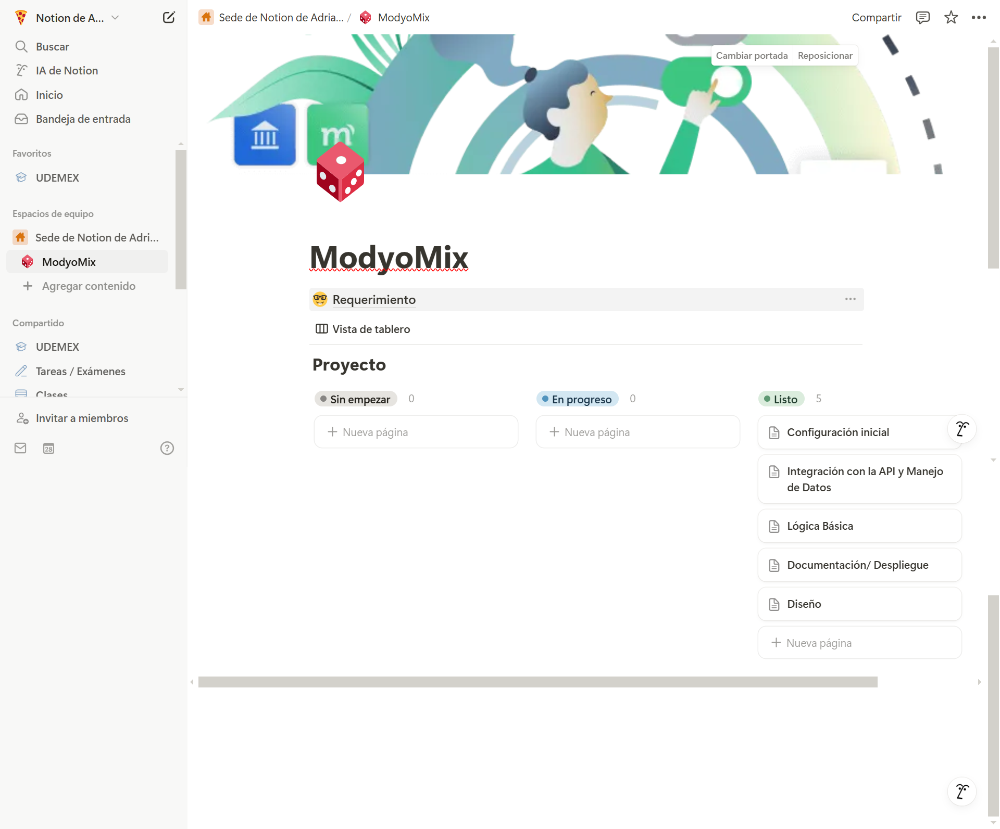

# ModyoMix: Juego de Memoria con Animales 🐾

¡Bienvenido a **ModyoMix**! Este es un juego de memoria clásico donde tu objetivo es encontrar todos los pares de animales en el menor tiempo posible y con la menor cantidad de errores. ¡Pon a prueba tu memoria y diviértete!

[ModyoMix](https://p1zz4crypt.github.io/modyomix/) 🔗

---

## **Descripción del Proyecto**

**ModyoMix** es un juego de memoria desarrollado con **React** que utiliza imágenes de animales obtenidas desde una API externa. El juego incluye un temporizador, un contador de aciertos y errores, y un sistema de persistencia del nombre del jugador usando `localStorage`.

---

## **Proceso de Desarrollo**

### **Planeación y Organización**
Antes de comenzar a codificar, realicé una planeación detallada del proyecto en **Notion**. Esta herramienta me permitió organizar las tareas, definir los requisitos y establecer un cronograma para el desarrollo. Aquí hay una captura de pantalla de mi tablero de planeación:



### **Pasos Seguidos**
1. **Análisis del Requerimiento**:
   - Leí y comprendí los requisitos del proyecto, identificando las funcionalidades clave (juego de memoria, temporizador, persistencia del nombre, etc.).
   - Definí los componentes principales: `Header`, `Board`, `Modal`, `StartModal`.

2. **Diseño de la Interfaz**:
   - Decidí usar **Bootstrap** y  para los estilos.

3. **Desarrollo del Código**:
   - Implementé la lógica del juego en React, utilizando estados y efectos para manejar el flujo del juego.
   - Integré la API de animales para obtener las imágenes de las cartas.
   - Añadí un temporizador y un sistema de persistencia del nombre usando `localStorage`.

4. **Despliegue**:
   - Configuré GitHub Pages para desplegar la aplicación.
   - Aseguré que el enlace de despliegue funcionara correctamente.

### **Herramientas Utilizadas**
- **Notion**: Para la planeación y organización del proyecto.
- **React**: Para el desarrollo de la lógica y los componentes.
- **Bootstrap**: Para los estilos y el diseño responsivo.
- **GitHub Pages**: Para el despliegue de la aplicación.

---

## **Funcionalidades Principales**

1. **Modal de Inicio**:

   - Solicita el nombre del jugador al iniciar el juego.
   - Muestra un mensaje de bienvenida con un efecto de texto animado.

2. **Tablero de Juego**:

   - Muestra un conjunto de cartas boca abajo con imágenes de animales.
   - Las imágenes se obtienen de una API externa.

3. **Mecánica del Juego**:

   - El jugador debe voltear las cartas para encontrar los pares.
   - Si las cartas coinciden, se suman **aciertos**.
   - Si no coinciden, se suman **errores** y las cartas se voltean de nuevo.

4. **Contador de Tiempo**:

   - Un temporizador mide cuánto tiempo tarda el jugador en completar el juego.
   - El tiempo se muestra en el header y en el mensaje de felicitación al final.

5. **Diseño Responsivo**:

   - El juego se adapta a diferentes tamaños de pantalla (móvil, tablet, escritorio).

6. **Modal de Felicitación**:

   - Cuando el jugador encuentra todos los pares, se muestra un modal con un mensaje de felicitación, el tiempo final y la opción de jugar de nuevo.

7. **Persistencia del Nombre**:

   - El nombre del jugador se guarda en `localStorage` para que no se solicite nuevamente al recargar la página.

8. **Efecto de Flip en las Cartas**:
   - Las cartas tienen un efecto de volteo suave y realista.

---

## **Tecnologías Utilizadas**

- **Frontend**:
  - React (para la lógica del juego y componentes).
  - TailwindCSS y Bootstrap 5 (para estilos y diseño responsivo).
- **API**:
  - [Modyo Animals API](https://fed-team.modyo.cloud/api/content/spaces/animals/types/game/entries?per_page=20) (para obtener imágenes de animales).
- **Herramientas**:
  - ESLint y Prettier (para mantener el código limpio y bien formateado).
  - Git (para el control de versiones).

---

## **Cómo Jugar**

Sigue estos pasos para jugar:

1. **Ingresa tu Nombre**:

   - Al iniciar el juego, se te pedirá que ingreses tu nombre. Este nombre se mostrará durante el juego y en el mensaje de felicitación.

2. **Voltea las Cartas**:

   - Haz clic en las cartas para voltearlas y hallar los pares.
   - Si las cartas coinciden, quedarán boca arriba.
   - Si no coinciden, se voltearán de nuevo después de un breve momento.

3. **Encuentra Todos los Pares**:

   - Sigue volteando cartas hasta que encuentres todos los pares de animales.

4. **Completa el Juego**:
   - Cuando encuentres todos los pares, se mostrará un mensaje de felicitación con tu tiempo final.
   - Puedes reiniciar el juego haciendo clic en "¡Otra vez!".


   **También puedes probarlo directamente desde el link**:
   👉[ModyoMix](https://p1zz4crypt.github.io/modyomix/)👈

---

## **Instalación y Ejecución**

Sigue estos pasos para ejecutar el proyecto en tu máquina local:

1. **Clona el Repositorio**:

   ```bash
   git clone https://github.com/tu-usuario/modyomix.git
   cd modyomix

   ```

2. **Instala las dependencias**:

```bash
npm install
```

3. **Ejecuta el proyecto**:
```bash
npm start
```


---

## **Mejoras Futuras**

- **Guardar Mejores Tiempos**: Implementar un sistema para guardar los mejores tiempos de los jugadores.
- **Dificultades**: Añadir niveles de dificultad (más cartas, menos tiempo, etc.).
- **Sonidos**: Incorporar efectos de sonido al voltear cartas y al ganar.
- **Animaciones**: Mejorar las animaciones de volteo de cartas y transiciones.
- **Uso de Redux**: Al integrar más funciones requeriría el uso de Redux para un estado global compartido.

---

## **Contribuciones**

¡Las contribuciones son bienvenidas! Si deseas mejorar el proyecto, sigue estos pasos:

1. Haz un fork del repositorio.
2. Crea una rama con tu nueva funcionalidad (`git checkout -b feature/nueva-funcionalidad`).
3. Realiza tus cambios y haz commit (`git commit -m "Añade nueva funcionalidad"`).
4. Haz push a la rama (`git push origin feature/nueva-funcionalidad`).
5. Abre un Pull Request.

---

## **Licencia**

Este proyecto está bajo la licencia **MIT**. Para más detalles, consulta el archivo [LICENSE](./LICENSE).

---

¡Gracias por jugar **ModyoMix**! 🎉  
Desarrollado con ❤️ por [Adriana Rosas](https://github.com/tu-usuario).
